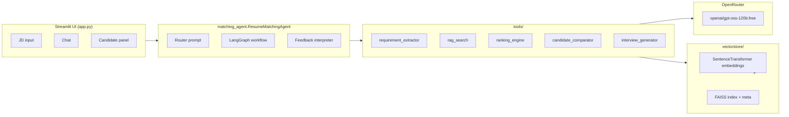

# Architecture & State Machine

This document explains how the Resume Matching Agent is wired together.
It complements the source code in `agents/graph_builder.py` and
`agents/nodes.py`.

---

## 1. High-level architecture



* **UI** — a single Streamlit page (`ui/chat_interface.py`) that handles JD
  upload, chat, the live shortlist table, and quick-action buttons.
* **Agent** — `ResumeMatchingAgent` wraps the LangGraph workflow.  It also
  owns conversation memory (LangGraph `MemorySaver`) and a small LLM-backed
  router that decides whether a user message is *new JD*, *feedback*,
  *comparison*, *interview*, *explanation*, or *approval*.
* **Tools** — domain functions that the nodes call.
* **Vector store** — FAISS + SentenceTransformers, persisted to
  `.vectorstore/` so the index survives restarts.
* **LLM** — every chat-completion call goes through `llm_client.get_chat_llm()`
  which targets OpenRouter using LangChain's `ChatOpenAI`.

---

## 2. LangGraph state machine

```mermaid
graph TD
    A([START]) --> B[parse_jd]
    B --> C[extract_requirements]
    C --> D[search_resumes]
    D -- empty pool --> Z([END])
    D --> E[rank_candidates]
    E --> F[generate_match_report]
    F --> G{human_feedback (interrupt)}
    G -- refine --> H[rerank]
    H --> F
    G -- approve --> I[final_recommendation]
    I --> Z([END])
```

### Node responsibilities

| Node                        | Purpose                                                                                              | Reads                          | Writes                                          |
|-----------------------------|------------------------------------------------------------------------------------------------------|--------------------------------|-------------------------------------------------|
| `parse_jd`                  | Produce a clean 3-5 sentence summary of the raw JD via LLM.                                          | `current_jd`                   | `jd_summary`, `stage`                           |
| `extract_requirements`      | LLM-driven structured extraction → `Requirements` (must-have, nice-to-have, years, certs, etc.).     | `current_jd`                   | `requirements`, `stage`                         |
| `search_resumes`            | RAG retrieval over the FAISS resume index using a query built from `requirements`.                   | `requirements`, `top_k`        | `candidates`, `all_candidates`                  |
| `rank_candidates`           | Composite scoring (must-have coverage + nice-to-have + experience + semantic + feedback shaping) and LLM explanations. | `candidates`, `requirements`, `human_feedback` | `candidates` (sorted), `ranking_explanations` |
| `generate_match_report`     | Markdown shortlist report + comparison table for the UI.                                             | `candidates`, `requirements`   | `match_report`, `awaiting_feedback=True`        |
| `human_feedback` (interrupt)| Pauses the graph until the orchestrator injects `state["human_feedback"]`.                           | `human_feedback`               | `stage`, `feedback_history`                     |
| `rerank`                    | Re-score from the FULL pool using the latest feedback; advances the screening round.                 | `all_candidates`, `human_feedback` | `candidates`, `round`, `stage`              |
| `final_recommendation`      | LLM-written hire / no-hire memo summarising the final shortlist + feedback history.                  | `candidates`, `feedback_history` | `final_recommendation`, `stage="done"`        |

### Conditional edges

* After **`search_resumes`** — if no candidates are retrieved, the graph
  short-circuits to `END` with an error message.  Otherwise it continues to
  `rank_candidates`.
* After **`human_feedback`** —
  * `state.stage == "final_recommendation"` → go to `final_recommendation`.
  * Otherwise → loop back through `rerank` → `generate_match_report` →
    `human_feedback`.

### Multi-round screening

The screening "funnel" is encoded in `rank_candidates_node` and `rerank_node`:

| Round | Pool source            | Kept |
|------:|------------------------|-----:|
| 1     | full RAG retrieval     | 10   |
| 2     | full pool + feedback   | 5    |
| 3+    | full pool + feedback   | 3    |

Each `CandidateMatch` records `round_reached` and `advanced` so the UI
funnel widget can visualise progression.

---

## 3. Conversational refinement

Free-form user messages are *not* fed directly to LangGraph.  Instead the
`ResumeMatchingAgent.send()` method calls an LLM-backed router prompt
(`agents/prompts.py → router_prompt`) that classifies the message into one
of:

* `new_jd`     — paste of a brand new JD ⇒ `start(...)`.
* `feedback`   — refinement (filter / boost / penalize) ⇒ resume graph through
  `human_feedback`.
* `compare`    — directly call `tools/candidate_comparator.compare_candidates`.
* `interview`  — directly call `tools/interview_generator.generate_interview_questions`.
* `explain`    — surface the existing `explanation` field for one candidate.
* `approve`    — set `feedback.approve=True` ⇒ graph → `final_recommendation`.
* `chat`       — small talk; doesn't modify workflow state.

Feedback messages are themselves interpreted by a second LLM call
(`interpret_feedback_prompt`) into a typed `HumanFeedback` object containing
`boost_skills`, `penalize_skills`, and `min_years_override` — which the
`ranking_engine` then uses to shape the score.

---

## 4. Memory

* In-process: `langgraph.checkpoint.memory.MemorySaver` keyed by
  `thread_id` (one per browser session in the Streamlit app).
* Each `agent.send()` call appends `HumanMessage` / `AIMessage` objects to
  the LangGraph `messages` channel (which uses the `add_messages` reducer),
  so the chat history persists across the entire conversation, including
  through workflow interrupts.

---

## 5. Where to look next

* `agents/state.py` — the typed state contract.
* `agents/graph_builder.py` — the LangGraph wiring.
* `agents/nodes.py` — one function per node.
* `tools/ranking_engine.py` — explainable scoring math.
* `matching_agent.py` — the conversational façade.
